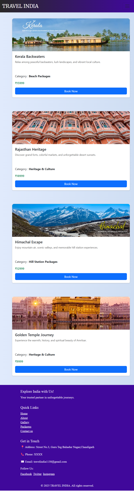
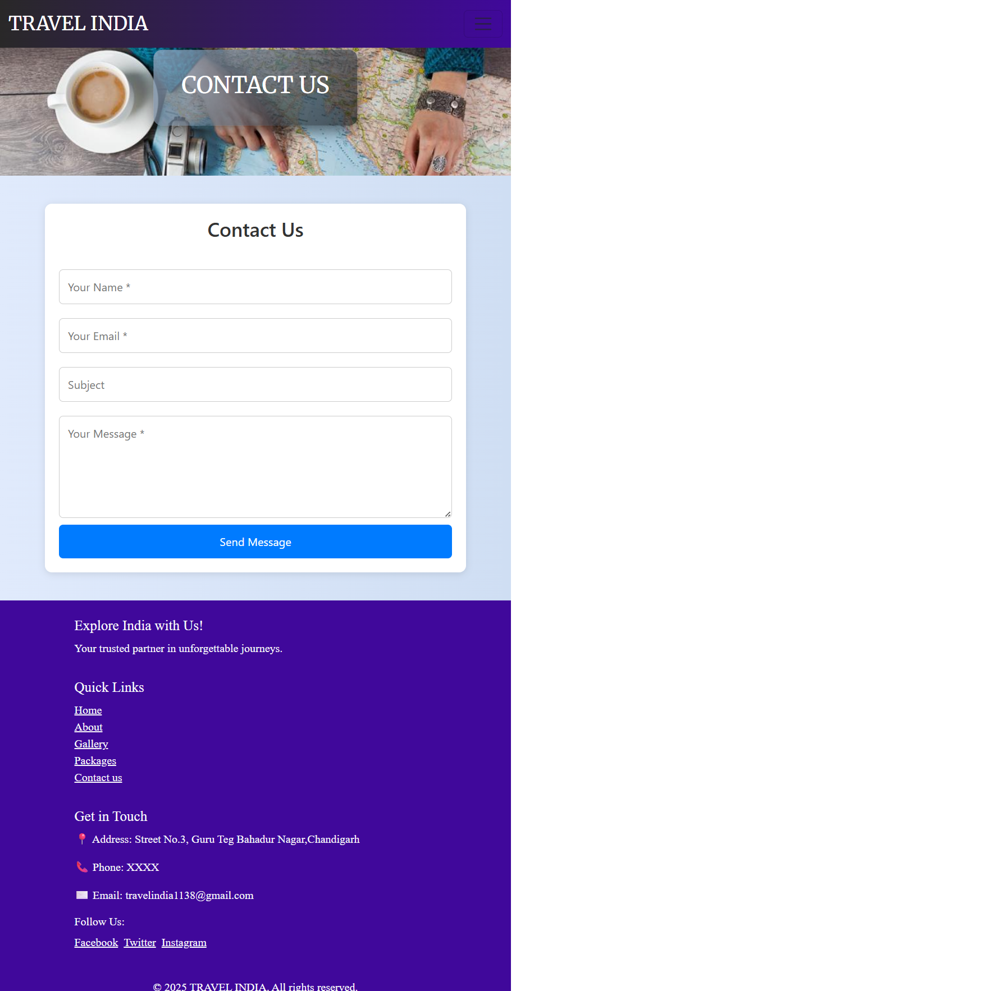
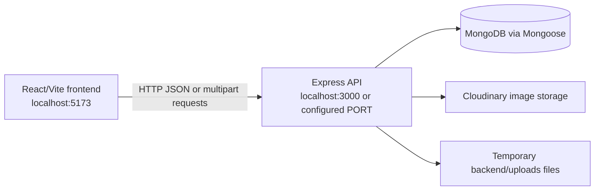

# TravelIndia

TravelIndia is a travel package booking application built as a small full-stack JavaScript project. It provides a public React website for browsing travel packages, user registration and login, package reservations, booking history, and an admin area for managing packages and bookings.

The repository contains two independently runnable applications:

- `frontend`: React 19 application powered by Vite.
- `backend`: Express API backed by MongoDB/Mongoose and Cloudinary image uploads.

## Running App

These screenshots were captured from the running frontend at `http://localhost:5173/`.

| Home | About |
| --- | --- |
|  |  |

| Gallery | Packages |
| --- | --- |
|  |  |

| Contact |
| --- |
|  |

## Features

### Public website

- Home, About, Gallery, Package, and Contact pages.
- Travel package listing loaded from the backend.
- Package category filtering in the package page.
- User registration and login.
- Booking form for authenticated users.
- User booking history and booking deletion.
- Responsive styling using regular CSS, Bootstrap, and React Bootstrap.

### Admin area

- Separate admin login and registration endpoints.
- Dashboard shell with sidebar navigation.
- Create travel packages with image upload.
- List and delete products.
- View, edit, delete, and delete all bookings.
- Dashboard metrics and chart components.

## Architecture



The frontend currently calls `http://localhost:3000` directly. There is no Vite development proxy or shared API client, so the backend must be available on port `3000` for the current frontend flows to work.

## Repository layout

```text
react/
|-- README.md
|-- backend/
|   |-- index.js                       Express entrypoint
|   |-- package.json                   Backend scripts and dependencies
|   |-- .env                           Local secrets and service configuration
|   |-- uploads/                       Temporary Multer upload directory
|   `-- src/
|       |-- config/
|       |   |-- db.js                  MongoDB connection
|       |   `-- cloudinary.js           Cloudinary configuration and upload helper
|       |-- controllers/
|       |   |-- Admin.js                Admin authentication
|       |   |-- auth.controller.js      User authentication
|       |   |-- booking.controller.js   Booking CRUD operations
|       |   `-- product.controller.js   Product CRUD and image upload
|       |-- middlewares/
|       |   |-- auth.middleware.js      Authentication middleware draft
|       |   |-- upload.js               Multer image upload configuration
|       |   `-- validate.middleware.js  Joi validation schemas
|       |-- models/
|       |   |-- admin.js                Admin schema
|       |   |-- booking.model.js         Booking schema
|       |   |-- product.model.js         Product schema
|       |   `-- user.model.js            User schema
|       `-- routes/
|           |-- admin.js                Admin auth routes
|           |-- auth.routes.js           User auth routes
|           |-- booking.routes.js        Booking routes
|           `-- product.route.js         Product routes
`-- frontend/
    |-- package.json                   Frontend scripts and dependencies
    |-- vite.config.js                 Vite configuration
    |-- index.html                     HTML entrypoint
    `-- src/
        |-- main.jsx                   React entrypoint and BrowserRouter
        |-- App.jsx                    Top-level route table
        |-- App.css, index.css          Global styles
        |-- Admin/                      Admin pages and layout components
        |-- components/                 Shared Navbar, Footer, and Toast
        |-- pages/                     Public pages and booking views
        `-- assets/                    Frontend assets
```

## Technology stack

### Frontend

- React 19
- React Router 7
- Vite 6
- Axios and Fetch API
- Bootstrap and React Bootstrap
- Lucide React and React Icons
- React Toastify
- Recharts
- ESLint 9

### Backend

- Node.js with ES modules
- Express 5
- MongoDB through Mongoose 8
- `dotenv` for configuration
- `bcryptjs` for user passwords
- `bcrypt` for admin passwords
- JSON Web Tokens
- Joi validation schemas
- Multer for multipart image uploads
- Cloudinary for hosted images
- CORS
- Nodemon for development

## Prerequisites

Install the following before running the project:

- Node.js 18 or newer. Node.js 20 or newer is recommended.
- npm.
- A reachable MongoDB database, such as MongoDB Atlas or a local MongoDB server.
- A Cloudinary account for creating products with images.

## Installation

Install dependencies in both applications:

```powershell
cd react/backend
npm install

cd ../frontend
npm install
```

The repository currently includes `node_modules` directories in the working environment, but a fresh checkout should install dependencies using the commands above.

## Environment configuration

Create `react/backend/.env` with values for the following variables. Do not commit real credentials.

```dotenv
PORT=3000
MONGO_URI=mongodb+srv://<username>:<password>@<cluster>/<database>?retryWrites=true&w=majority
JWT_SECRET=replace-with-a-long-random-secret
CLOUDINARY_CLOUD_NAME=your-cloud-name
CLOUDINARY_API_KEY=your-api-key
CLOUDINARY_API_SECRET=your-api-secret
```

### Environment variable reference

| Variable | Used by | Purpose |
| --- | --- | --- |
| `PORT` | `backend/index.js` | HTTP port. The backend defaults to `8080`; use `3000` with the current frontend URLs. |
| `MONGO_URI` | `backend/src/config/db.js` | MongoDB connection string. |
| `JWT_SECRET` | `backend/src/controllers/auth.controller.js` | Signs regular user JWTs. |
| `CLOUDINARY_CLOUD_NAME` | `backend/src/config/cloudinary.js` | Cloudinary cloud name. |
| `CLOUDINARY_API_KEY` | `backend/src/config/cloudinary.js` | Cloudinary API key. |
| `CLOUDINARY_API_SECRET` | `backend/src/config/cloudinary.js` | Cloudinary API secret. |

The backend loads `.env` using `dotenv`. Cloudinary first receives a temporary file written to `backend/uploads/`, then the upload helper removes that local file after a successful upload.

## Running the application

Start the backend in one terminal:

```powershell
cd react/backend
npm start
```

The backend uses Nodemon and is normally available at:

```text
http://localhost:3000
```

Start the frontend in a second terminal:

```powershell
cd react/frontend
npm run dev
```

The Vite development server is normally available at:

```text
http://localhost:5173
```

A quick backend health check is:

```powershell
Invoke-WebRequest http://localhost:3000/ -UseBasicParsing
```

Expected response body:

```text
API is working...
```

### Frontend scripts

Run these from `react/frontend`:

| Command | Purpose |
| --- | --- |
| `npm run dev` | Start the Vite development server. |
| `npm start` | Alias for the Vite development server. |
| `npm run build` | Create a production build in `dist/`. |
| `npm run preview` | Preview the production build locally. |
| `npm run lint` | Run ESLint. |

### Backend scripts

Run these from `react/backend`:

| Command | Purpose |
| --- | --- |
| `npm start` | Start `nodemon index.js`. |
| `npm test` | Placeholder script; currently exits with an error because no tests are configured. |

## Frontend routes

The top-level route table is defined in `frontend/src/App.jsx`.

| URL | Component | Purpose |
| --- | --- | --- |
| `/` | `Home` | Public landing page. |
| `/about` | `About` | About page. |
| `/gallery` | `Gallery` | Travel image gallery. |
| `/package` | `Package` | Product listing, category filtering, and booking modal. |
| `/contact` | `Contact` | Contact form. |
| `/login` | `Login` | User login. |
| `/register` | `Register` | User registration. |
| `/mybooking` | `MyBookings` | Current user's bookings. |
| `/admin` | `AdminLogin` | Admin login. |
| `/Adminlogin` | `AdminLogin` | Alternate admin login path. |
| `/dashboard/*` | `Dashboard` | Admin dashboard shell. |
| `/dashboard/booking` | `Bookings` | Booking administration. |
| `/dashboard/product` | `Product` | Product administration. |

The dashboard also contains links to product creation and other admin screens through `frontend/src/Admin/Sidebar.jsx` and `frontend/src/Admin/Dashboard.jsx`. Some admin paths use inconsistent capitalization, so links should be kept consistent with the existing components.

Important frontend implementation details:

- `frontend/src/main.jsx` enables `StrictMode`, `BrowserRouter`, and global styles.
- `frontend/src/components/Navbar.jsx` and `Footer.jsx` are shared by public pages.
- `frontend/src/pages/Package.jsx` fetches products and submits bookings.
- `frontend/src/pages/Login.jsx` stores login state and the user ID in browser local storage.
- `frontend/src/pages/MyBookings.jsx` uses the stored user ID to request bookings.
- `frontend/src/Admin/CreateProduct.jsx` sends multipart form data with the image field named `image`.
- `frontend/src/Admin/Bookings.jsx` consumes the booking management endpoints.
- `frontend/src/pages/popup.jsx`, `Rhome.jsx`, `Rgallery.jsx`, and `ct.jsx` are standalone or legacy implementations and are not all mounted by the current top-level route table.

## Backend API

The backend entrypoint is `backend/index.js`. It enables CORS and JSON parsing, mounts the route modules, attempts a MongoDB connection, and starts the HTTP server.

### Health endpoint

```text
GET /
```

Returns `API is working...`.

### User authentication

Mounted at `/auth` and implemented by `auth.controller.js`.

| Method | Endpoint | Body | Result |
| --- | --- | --- | --- |
| `POST` | `/auth/register` | `{ name, email, password, phone?, isAdmin? }` | Creates a user and returns a JWT plus user object. |
| `POST` | `/auth/login` | `{ email, password }` | Checks credentials and returns a JWT plus user object. |

Passwords are hashed with `bcryptjs`. Tokens are signed with `JWT_SECRET` and expire after one hour.

### Admin authentication

Mounted at `/api` and implemented by `controllers/Admin.js`.

| Method | Endpoint | Body | Result |
| --- | --- | --- | --- |
| `POST` | `/api/register` | `{ email, password }` | Creates an admin account. |
| `POST` | `/api/login` | `{ email, password }` | Checks admin credentials and returns an admin JWT. |

Admin authentication uses the same `JWT_SECRET` environment variable as regular user authentication.

### Products

Mounted at `/api` and implemented by `product.controller.js`.

| Method | Endpoint | Body | Result |
| --- | --- | --- | --- |
| `POST` | `/api/products` | Multipart fields `name`, `description`, `price`, `category`, and image file field `image` | Uploads the image to Cloudinary and creates a product. |
| `GET` | `/api/products` | None | Returns all products in `data`. |
| `GET` | `/api/products/:id` | None | Returns one product in `data`. |
| `PUT` | `/api/products/:id` | JSON fields `name`, `description`, `price`, `category` | Updates product fields. The route currently does not attach Multer, so replacement image uploads are not parsed. |
| `DELETE` | `/api/products/:id` | None | Deletes one product. |

Product fields are:

- `name`: required string.
- `description`: required string.
- `image`: required image URL.
- `price`: required non-negative number.
- `category`: one of `Hill Station Packages`, `Beach Packages`, `Heritage & Culture`, or the currently stored value ` Pilgrimage Tours`.

### Bookings

Mounted at `/api/booking` and implemented by `booking.controller.js`.

| Method | Endpoint | Body | Result |
| --- | --- | --- | --- |
| `POST` | `/api/booking/create/:id` | `{ name, email, phone, date, time?, guests, productId?, productName? }` | Creates a booking associated with the `:id` user ID. |
| `GET` | `/api/booking/:id` | None | Returns bookings for a user ID. |
| `GET` | `/api/booking/alls` | None | Returns all bookings and the total count. |
| `PUT` | `/api/booking/:id` | `{ name, email, phone, date, time, guests }` | Updates a booking. |
| `DELETE` | `/api/booking/:id` | None | Deletes one booking. |
| `DELETE` | `/api/booking/all` | None | Deletes all bookings. |

A booking contains optional `userId`, `productId`, and `productName` fields, required contact/date/guest fields, and a `status` with the values `Pending`, `Confirmed`, or `Cancelled`. The default status is `Confirmed`.

## Data model summary

### User

Defined in `backend/src/models/user.model.js`. Stores a name, unique email, hashed password, optional admin flag, and timestamps. The registration controller accepts `phone`, but the current user schema does not define a phone field, so it is not persisted by Mongoose by default.

### Admin

Defined in `backend/src/models/admin.js`. Stores a unique lowercase email and a hashed password.

### Product

Defined in `backend/src/models/product.model.js`. Stores package name, description, image URL, price, and category.

### Booking

Defined in `backend/src/models/booking.model.js`. Stores optional user/product references, customer contact details, travel date/time, guest count, status, and timestamps.

## Security and implementation notes

The project is suitable for development and demonstration, but the following areas should be addressed before production deployment:

- Product and booking mutation routes are currently not protected by active authentication middleware.
- `auth.middleware.js` is not currently mounted on the protected routes.
- The frontend contains hardcoded service URLs instead of a configurable API base URL.
- The contact form contains a Web3Forms access key in frontend source. Rotate it if it has been exposed and move service configuration to an appropriate environment strategy.
- The product category enum includes a leading space in ` Pilgrimage Tours`, while the admin form uses `Pilgrimage Tours` without that space.
- The backend catches MongoDB connection errors but still starts the HTTP server, so health checks can pass while database requests fail.
- CORS is enabled for all origins.
- There are no automated backend tests.

## Current validation status

The application has been checked in the current workspace:

- `npm run build` in `frontend` succeeds.
- `npm run lint` in `frontend` currently reports seven errors, including unused variables/imports and an undefined `handleSubmit` reference in `src/pages/popup.jsx`.
- The backend starts and responds to `GET /`.
- The configured MongoDB hostname currently fails DNS resolution in the local environment, so database-backed flows require a corrected or reachable `MONGO_URI`.

## Development workflow

1. Configure `backend/.env` with a reachable MongoDB URI and Cloudinary credentials.
2. Start the backend on port `3000`.
3. Start the frontend on port `5173`.
4. Register a user and log in through `/register` and `/login`.
5. Seed products through the admin UI or `POST /api/products`.
6. Browse packages at `/package` and create a booking.
7. Review bookings through `/mybooking` or the admin dashboard.
8. Run `npm run lint` and `npm run build` from `frontend` before submitting changes.
